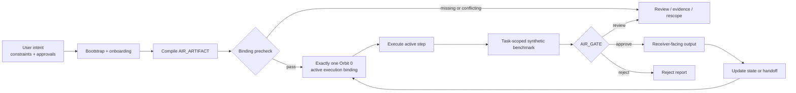
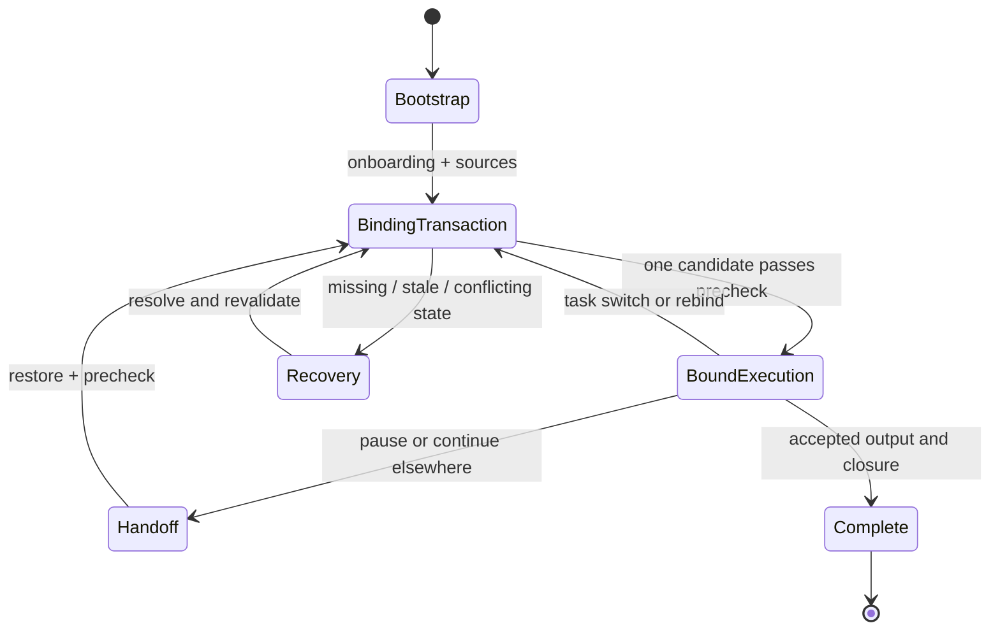
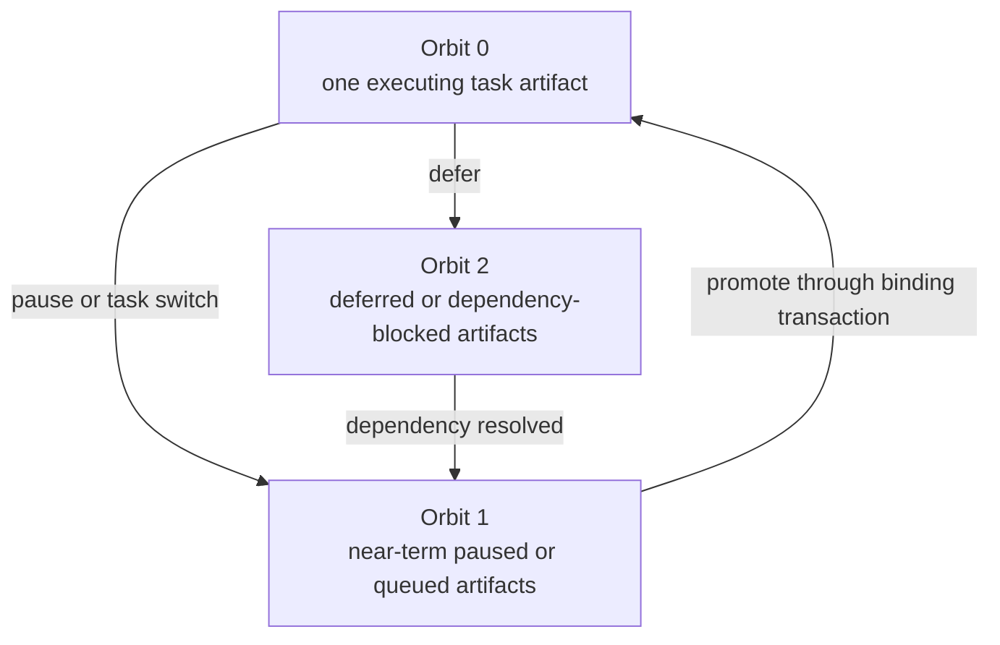
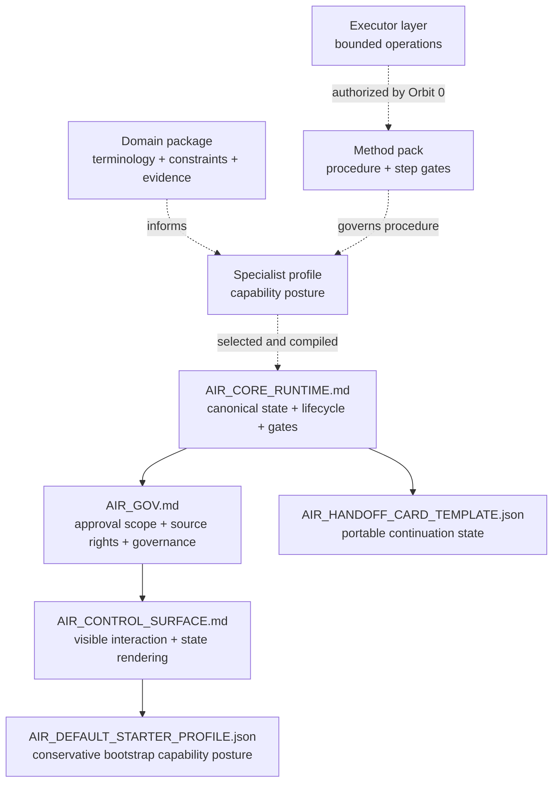
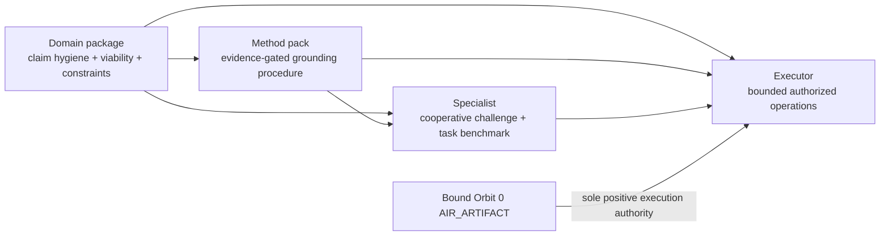
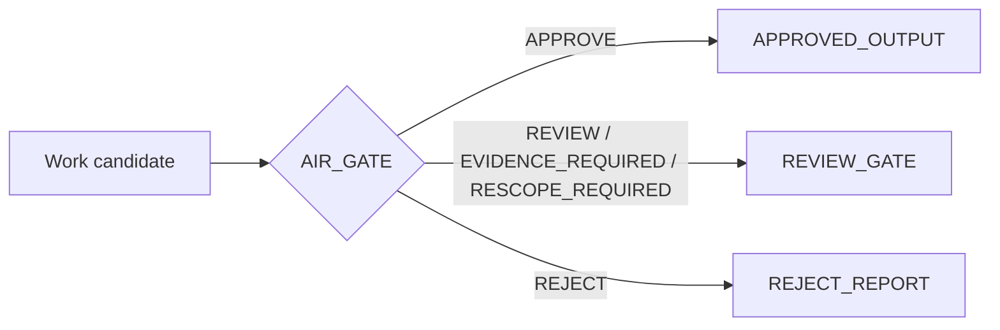

[](https://vm4ai.com)

# AIR by VM4AI

[](LICENSE)
[](prompts/AIR_CORE_RUNTIME.md)
[](#what-air-is)
[](#the-execution-loop)

**Structure for serious AI work. Configure. Organize. Execute.**

AIR — **AI Resource** — is a prompt-layer compiler/runtime contract for turning an ordinary model session into structured project execution. The user directs intent, constraints, corrections, and approvals. AIR keeps the active task, evidence, scope, blockers, evaluation, delivery state, and continuity explicit.

**Website:** [vm4ai.com](https://vm4ai.com) · **Brand:** [eddlev/air-brand](https://github.com/eddlev/air-brand) · **Discussions:** [Ask and share](https://github.com/eddlev/vm4ai-air-kit/discussions)

---

## What AIR is



AIR is **cooperative, not autonomous**. It does not create independent authority, legal status, professional credentials, backend enforcement, hidden-reasoning access, or guaranteed correctness.

Prompt-compiled AIR can improve structure, continuity, reviewability, and execution discipline inside a model session. It is not the private VM4AI backend/client runtime.

---

## The execution loop



Three rules carry most of AIR's logic:

1. **One active artifact.** Material execution is authorized only by exactly one bound `AIR_ARTIFACT` in Orbit 0.
2. **Evidence before claims.** Unsupported, stale, ambiguous, or permission-blocked material claims route to review, evidence required, rescope, or rejection.
3. **Visible state changes.** Binding, task switches, blockers, approvals, handoff, mutation, and closure do not happen silently.

---

## Orbit model



Orbit is task state, not conversational importance. Queued artifacts may inform planning, but they do not execute until promoted and bound.

---

## Runtime stack



The foundation is always subordinate to the Core Runtime's canonical object classes, lifecycle, gate decisions, binding rules, and floor invariants. Optional packages are **available, not active**, until validated, selected, and compiled into or referenced by the bound Orbit 0 artifact.

---

## Quick start

Attach the five canonical foundation files from [`prompts/`](prompts/):

```text
AIR_CORE_RUNTIME.md
AIR_CONTROL_SURFACE.md
AIR_GOV.md
AIR_DEFAULT_STARTER_PROFILE.json
AIR_HANDOFF_CARD_TEMPLATE.json
```

Then type:

```text
Start a new AIR project.
```

AIR verifies load integrity, prints the required boot state, says `Welcome to AIR.`, and begins at Q1. The activation phrase starts the bootstrap route; it does **not** answer Q1 for you.

### Continue from a handoff

Attach the relevant current foundation files plus your completed `AIR_HANDOFF_CARD`, then type:

```text
Continue project from handoff card.
```

A handoff is restoration input, not execution authority. AIR rechecks current files, sources, permissions, compatibility, approvals, and binding before resuming.

---

## Grounding package

The complete Grounding package lives in [`profiles/grounding specialist/`](profiles/grounding%20specialist/):

```text
AIR_GROUNDING_DOMAIN_PACKAGE.json
AIR_GROUNDING_METHOD_PACK.json
AIR_GROUNDING_SPECIALIST.json
AIR_GROUNDING_EXECUTOR.json
AIR_GROUNDING_SPECIALIST_PACKAGE_MANIFEST.json
```



Use Grounding when ambitious, uncertain, frontier, or high-claim work needs reality binding without flattening the underlying ambition. It separates what is evidenced now, what is executable, what remains frontier work, what is blocked, and what is still unknown.

---

## Decision and delivery states



An approval is scoped to the exact gate and authorized action identifiers. Approval of a plan does not automatically authorize file mutation, publication, deployment, release, storage, redistribution, or destructive action.

---

## Repository map

```text
prompts/                         AIR v2 foundation
profiles/grounding specialist/  complete Grounding package
docs/                            supporting documentation
README.md                        visual orientation and quick start
```

Canonical operational filenames use ASCII letters, numbers, underscores, hyphens, and periods. Transport counters such as `(10)` are not versions and are not retained in repository filenames.

---

## What AIR is for

AIR is useful when work benefits from explicit scope, active-step discipline, evidence-aware claims, review before delivery, reusable methods, specialist routing, or continuity across sessions. Typical uses include software and systems design, research synthesis, architecture and security review, product and operational planning, documentation work, governance-adjacent analysis, and long-running multi-step projects.

AIR is deliberately not “faster vibes.” It is a structure for making model-assisted work easier to inspect, challenge, continue, and trust proportionately.

---

## License

Licensed under the [Apache License 2.0](LICENSE). See [NOTICE](NOTICE) for attribution and project notices.
