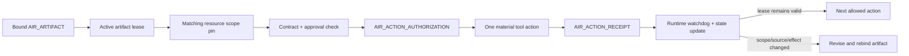

# AIR Runtime Drift Hardening

> **Historical record — non-operative.** This document preserves patch/audit history. Current runtime, governance, compatibility, and release authority comes from the current files under `prompts/` and current package manifests.

## Purpose

This patch hardens the gap between AIR's declared runtime rules and the moment a material action actually occurs.

The observed failure pattern was not a lack of doctrine. The runtime already required visible artifact binding and prompt-side re-anchoring. The failure was **action/rule decoupling**: tool actions could occur before onboarding completed, before the current artifact was emitted, or after the artifact became stale.

## Control chain

No later object retroactively authorizes an earlier unbound effect.

## New canonical records

### AIR_ACTION_AUTHORIZATION

A single-use pre-action record. It binds one exact action to the current artifact revision, lease, scope pin, approval basis, target, expected effect, stop conditions, recovery path, and receipt evidence.

### AIR_ACTION_RECEIPT

A post-action record. It captures the actual target, tool or operator evidence, result identifiers, expected-versus-actual state, side effects, validation result, and artifact-lease effect.

### AIR_PRIOR_EFFECT_RECORD

A recovery record for an effect that occurred without a valid current interlock. It preserves the effect and reconciliation decision without rewriting history as authorized.

## Artifact lease

Every bound artifact carries a lease. The lease expires when a material element changes, including active step, target resource, action class, source set, approval, environment, method, benchmark, risk, or acceptance criteria.

An expired lease has no positive execution authority. The artifact must be revised and rebound.

## Resource scope pin

The scope pin names the exact repositories, branches, paths, systems, environments, credential classes, and action classes permitted for the active step.

Discovery is not authorization. A similarly named or adjacent resource remains out of scope until the artifact is visibly revised and the required approval is obtained.

## Enforcement tiers

| Tier | Capability | Boundary |
|---|---|---|
| Prompt layer | Surfaces and applies the interlock, receipts, watchdog, and recovery records | Cannot guarantee the host model never skips a rule |
| Client/tool gateway | Rejects calls without a current authorization and consumes it atomically | Requires an enforcing wrapper or connector proxy |
| Backend audit trail | Preserves append-only authorization, action, and receipt evidence | Requires backend implementation and operational controls |

The public prompt kit must state which tier actually applies. Prompt-layer behavior is not backend enforcement.

## Handoff behavior

Action authorizations do not survive handoff as executable authority. A handoff may preserve historical authorizations, receipts, requested action context, scope pins, and unresolved prior effects. Continuation must revalidate and issue a new authorization after artifact rebinding.

## Mainline version changes

- AIR Core Runtime: `2.0.0` -> `2.1.0`
- AIR Control Surface: `2.0.0` -> `2.1.0`
- AIR Default Starter: `2.1.1` -> `2.2.0`
- AIR Handoff Card Template schema: `2.0.0` -> `2.1.0`; template `card_revision` becomes `3`
- Specialist package integration release: `2.2.1` -> `2.3.0`
- Universal material-action coupling is registered as `AIR-FLOOR-018`

## Mainline review disposition

The candidate control architecture was accepted. The mainline maintainer rejected copying candidate bytes directly because they were built from the superseded v2.2.0 foundation and refreshed only the Grounding manifest. The accepted doctrine was rebased onto v2.2.1, the Starter version-consistency hotfix was preserved, the Handoff schema was versioned correctly, and all three specialist packages were resealed.
